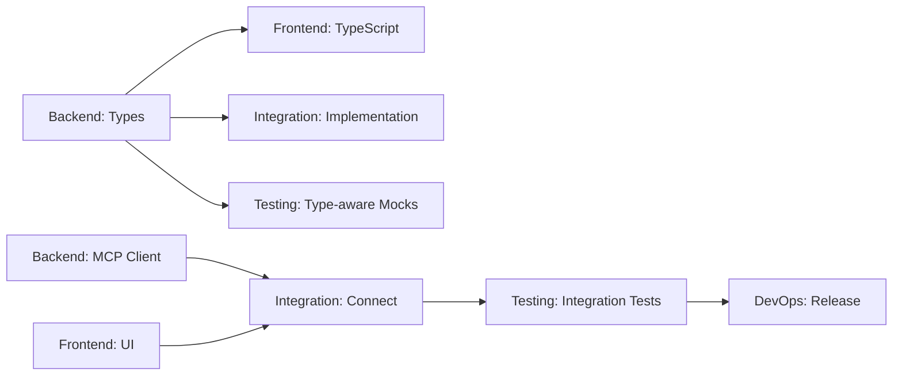

# Parallel Execution Guide for Copilot-MCP Bridge

## Quick Start for Each Agent

### 1. Backend Agent - Start Immediately
```bash
# Your workspace: /workspaces/backend
git checkout -b feature/backend-core

# First task: Create extension scaffold
cd /Users/andrewdo/Documents/Andrew/Coding/mymcp/mymcp
npm init -y
npm install -D @types/vscode @types/node typescript esbuild

# Create initial structure
mkdir -p src/{mcp,types,utils}
touch src/extension.ts src/types/index.ts

# Start with types (others depend on this!)
# Create src/types/mcp.ts with all interfaces from tickets
```

### 2. Frontend Agent - Start Immediately  
```bash
# Your workspace: /workspaces/frontend
git checkout -b feature/frontend-ui

# First task: Setup UI structure
mkdir -p media src/ui
touch media/config.{html,css,js}
touch src/ui/configWebview.ts

# Can work independently on HTML/CSS
# Wait for backend types before TypeScript work
```

### 3. Testing Agent - Start Immediately
```bash
# Your workspace: /workspaces/testing
git checkout -b feature/testing-infrastructure

# First task: Setup test framework
npm install -D mocha chai sinon @types/mocha
mkdir -p src/test/{unit,integration,mocks}

# Create mock implementations immediately
# These will be needed by all other agents
```

### 4. Integration Agent - Start After Types Ready
```bash
# Your workspace: /workspaces/integration
git checkout -b feature/copilot-integration

# Wait for: Backend to define MCP types
# First task: Research Copilot APIs and create prototypes
touch src/copilot/chatParticipant.ts

# Can start with command parsing logic independently
```

### 5. DevOps Agent - Start Immediately
```bash
# Your workspace: /workspaces/devops
git checkout -b feature/devops-infrastructure

# First task: Setup GitHub Actions
mkdir -p .github/workflows
touch .github/workflows/{ci.yml,release.yml}

# Work completely independently
# Set up all automation pipelines
```

## Parallel Work Blocks

### Block 1: Foundation (Days 1-2)
**Can work in parallel:**
- Backend: Types, interfaces, project structure
- Frontend: HTML/CSS, webview design
- Testing: Mock framework, test utilities
- DevOps: CI/CD pipelines, build scripts

**Dependencies:** None

### Block 2: Core Implementation (Days 3-5)
**Can work in parallel:**
- Backend: MCP client, transport layers
- Frontend: Webview logic (using backend types)
- Integration: Chat participant (using backend types)
- Testing: Unit tests for each component

**Dependencies:** Backend types must be complete

### Block 3: Integration (Days 6-7)
**Sequential work required:**
1. All agents merge to develop branch
2. Integration agent connects components
3. Testing agent runs integration tests
4. Frontend agent fixes UI issues

**Dependencies:** All core features complete

### Block 4: Polish & Release (Days 8-10)
**Can work in parallel:**
- Testing: E2E tests, performance tests
- DevOps: Release preparation, documentation
- All: Bug fixes in own domains

**Dependencies:** Integration complete

## Critical Path & Dependencies



## Daily Sync Schedule

### Morning Sync (9 AM)
```yaml
# Post to agents/daily/YYYY-MM-DD-morning.yaml
backend:
  completed_yesterday: [types, extension.ts]
  blocking_others: false
  needs_from_others: null
  
frontend:
  completed_yesterday: [webview HTML/CSS]
  blocking_others: false
  needs_from_others: [backend/types]
```

### Evening Update (5 PM)
```yaml
# Post to agents/daily/YYYY-MM-DD-evening.yaml
backend:
  completed_today: [mcp client base]
  ready_for_integration: [types, client interface]
  tomorrow_plan: [transport implementation]
```

## Shared Code Protocol

### When Creating Shared Code
1. Create in your feature branch first
2. If others need it immediately:
   ```bash
   # Create a shared branch
   git checkout -b shared/types-v1
   git add src/types/*
   git commit -m "shared: MCP type definitions"
   git push
   
   # Notify in agents/shared/updates.log
   echo "2024-01-15 10:30 - Backend: Pushed MCP types to shared/types-v1" >> updates.log
   ```

### When Using Shared Code
```bash
# In your feature branch
git pull origin shared/types-v1
git merge shared/types-v1
```

## Conflict Avoidance Strategy

### 1. File Ownership
```yaml
file_ownership:
  "src/extension.ts": backend
  "src/mcp/**": backend
  "src/ui/**": frontend
  "src/copilot/**": integration
  "src/test/**": testing
  "media/**": frontend
  ".github/**": devops
  "scripts/**": devops
```

### 2. Interface Contracts
- Define all interfaces in `src/types/`
- Only backend agent modifies types
- Others consume types as read-only
- Request changes via PR comments

### 3. Working in Isolation
Each agent should:
1. Mock external dependencies
2. Create local test harnesses
3. Validate against interfaces
4. Test in isolation before integration

## Integration Checkpoints

### Checkpoint 1: Types Agreement (Day 2)
- Backend publishes all types
- All agents review and approve
- Types are frozen for v1

### Checkpoint 2: API Verification (Day 4)
- Each agent demos their API
- Verify interface compatibility
- Adjust if needed

### Checkpoint 3: First Integration (Day 6)
- Merge all branches to develop
- Run integration tests
- Fix any issues

### Checkpoint 4: Release Candidate (Day 9)
- Feature freeze
- Only bug fixes allowed
- Prepare for release

## Emergency Protocols

### If Blocked
1. Post to `agents/blockers.md`
2. Try to work on non-blocked tasks
3. Create mock/stub to continue
4. Escalate after 2 hours

### If Behind Schedule
1. Identify critical path items
2. Request help from other agents
3. Consider scope reduction
4. Update timeline estimates

### If Integration Fails
1. Revert to last working state
2. Identify breaking change
3. Fix in feature branch
4. Re-attempt integration

## Success Criteria

### Individual Agent Success
- [ ] All assigned tickets complete
- [ ] Code passes all quality checks
- [ ] Integration tests pass
- [ ] Documentation complete

### Project Success
- [ ] Extension activates without errors
- [ ] All features working end-to-end
- [ ] Performance benchmarks met
- [ ] Ready for marketplace submission