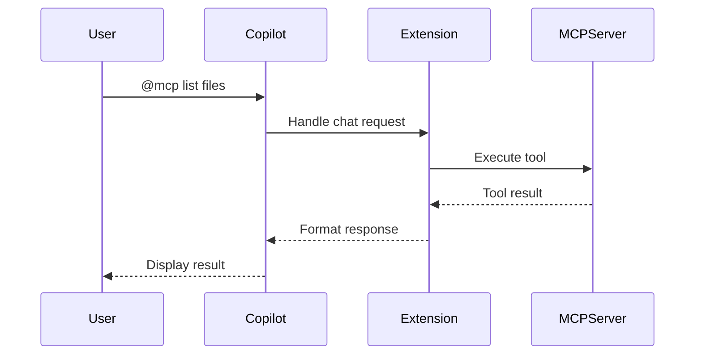

# Architecture: GitHub Copilot Integration Strategy

## Ticket Description
Design the integration approach for connecting MCP capabilities to GitHub Copilot, working within the constraints of Copilot's extension API.

## Acceptance Criteria
- [x] Copilot API integration points identified
- [x] Context injection method designed
- [x] Tool invocation flow documented
- [x] Performance impact analyzed
- [x] Fallback strategies defined

## Integration Approach

### 1. Chat Participant API
Register as a Copilot chat participant to handle MCP-related queries:
```typescript
vscode.chat.registerChatParticipant('mcp-bridge', {
    name: 'MCP Tools',
    description: 'Access MCP server tools',
    isDefault: true,
    handler: async (request, context, progress, token) => {
        // Handle MCP tool invocations
    }
});
```

### 2. Context Enhancement Strategy
Since we cannot directly modify Copilot's prompts, we'll use these approaches:

#### Option A: Chat Variables
```typescript
// Register context variables that users can reference
vscode.chat.registerChatVariableProvider('mcp', {
    resolveVariable: async (name, context, token) => {
        // Return MCP tool results as variables
        return [{
            level: vscode.ChatVariableLevel.Full,
            value: await mcpClient.executeTool(name),
            description: `MCP tool: ${name}`
        }];
    }
});
```

#### Option B: Inline Suggestions
```typescript
// Provide inline suggestions with MCP context
vscode.languages.registerInlineCompletionItemProvider('*', {
    provideInlineCompletionItems: async (document, position, context, token) => {
        // Augment completions with MCP context
    }
});
```

### 3. Tool Invocation Flow


### 4. Command Registration
```typescript
// Register commands for MCP operations
vscode.commands.registerCommand('mcp-bridge.executeTool', async (toolName: string, args: any) => {
    // Execute MCP tool and return result
});

vscode.commands.registerCommand('mcp-bridge.listTools', async () => {
    // List available MCP tools
});
```

### 5. Context Limits Management
- Monitor token usage in prompts
- Implement intelligent truncation
- Prioritize most relevant MCP results
- Cache frequently used contexts

## Performance Considerations
1. **Lazy Loading**: Only connect to MCP servers when needed
2. **Async Operations**: All MCP calls must be non-blocking
3. **Timeout Management**: Implement timeouts for MCP operations
4. **Result Caching**: Cache tool results with TTL
5. **Batch Operations**: Combine multiple tool calls when possible

## Security Model
- Prompt user for MCP server permissions
- Sanitize all MCP responses before injection
- Implement rate limiting for tool executions
- Log all MCP operations for audit
- Secure credential storage using VS Code secrets API

## Fallback Strategies
1. If Copilot API is unavailable: Provide standalone commands
2. If MCP server fails: Show cached results with warning
3. If context too large: Summarize or paginate results
4. If performance degrades: Disable non-essential features